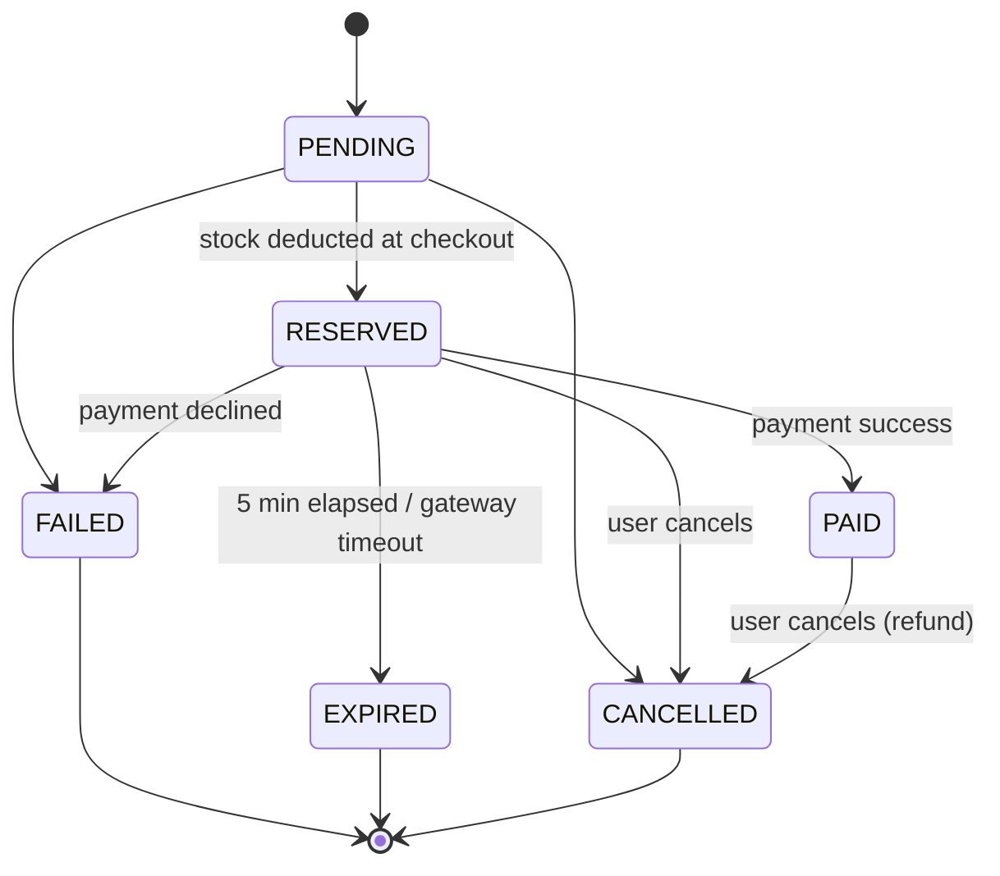

# POS-System

## Stock Reservation

- **Reserve on checkout** — `POST /api/orders/checkout/{cartId}` atomically deducts stock (products locked in ascending ID order) and creates an order in `RESERVED` status with `expiresAt = now + 5 minutes`. The response includes `reservationSecondsRemaining`.
- **Automatic expiry** — `ReservationExpiryScheduler` runs every 5 seconds, finds `RESERVED` orders past `expiresAt`, marks each `EXPIRED` and returns its quantities to available stock, each in its own transaction.
- **Immediate release** — fetching an order (`GET /api/orders/{id}` or `/number/{orderNumber}`) expires it on the spot if it is overdue, so no client sees a stale reservation between scheduler runs.
- **Released exactly once** — every release takes a `SELECT ... FOR UPDATE` lock on the order and re-checks its status, so concurrent attempts (scheduler, reads, multiple instances) cannot restore the same stock twice.
- **Stock overview** — `GET /api/products/stock` lists `availableStock` and `reservedStock` for every product.

## Mock Payment

`POST /api/orders/{orderId}/payments` with optional body `{"simulatedOutcome": "SUCCESS" | "FAILURE" | "TIMEOUT"}` (random if omitted) and optional `Idempotency-Key` header. `GET /api/orders/{orderId}/payments` lists attempts.

| Gateway outcome | Payment | Order | Stock | HTTP |
|---|---|---|---|---|
| SUCCESS | `SUCCESS` | `PAID` | stays deducted | 200 |
| FAILURE | `FAILED` | `FAILED` | released | 402 |
| TIMEOUT (no response within `gateway-timeout-ms`) | `TIMEOUT` | `EXPIRED` | released | 504 |

Flow: a short transaction locks the order and records a `PROCESSING` payment, the gateway is called with a timeout **outside** any transaction, then a second transaction locks the order again and applies the outcome. While a payment is in flight the expiry job leaves that order alone.

Duplicate detection (all return `409 Conflict`):
- Paying an order that is already `PAID`, or while another payment for it is `PROCESSING`.
- Reusing an `Idempotency-Key` (also enforced by a unique DB constraint).
- Checking out the same cart twice — checkout locks the cart row, so a concurrent second submission waits, finds the cart already converted and is rejected with the existing order number.

Paying an expired reservation returns `410 Gone` (and releases its stock immediately); paying a `FAILED`/`CANCELLED` order returns `409`.

## Order Lifecycle

- **Transitions are enforced** — allowed transitions are defined once in `OrderStatus`; `Order.status` has no setter and changes only through `Order.transitionTo`, which throws `InvalidOrderStateException` (409) for anything else. Order responses include `allowedTransitions`.
- **Stock follows status** — only `RESERVED` and `PAID` hold stock. `OrderLifecycleService.transition` restores an order's quantities whenever it moves from a stock-holding status to `CANCELLED`, `EXPIRED` or `FAILED`, in the same transaction as the status change. Final statuses allow no further transitions, so stock is never restored twice.
- **Cancellation** — `POST /api/orders/{id}/cancel` cancels a `RESERVED` or `PAID` order, restoring stock and marking successful payments `REFUNDED`. The gateway refund is issued only after the cancellation commits. Cancelling a final order, or one with a payment in progress, returns 409.
- **Consistency under failure** — every state change runs in a single transaction under a row lock on the order: a checkout that fails part-way rolls back all deductions and leaves the cart intact; lock timeouts/deadlocks are rolled back and returned as 409 so clients can retry; abandoned `PROCESSING` payments are closed as `TIMEOUT` when their order is finalized.

## Configuration (`application.properties`)

| Property | Default | Meaning |
|---|---|---|
| `pos.reservation.ttl-minutes` | `5` | How long a checkout holds its stock |
| `pos.reservation.expiry-check-interval-ms` | `5000` | How often expired reservations are released |
| `pos.payment.gateway-timeout-ms` | `3000` | Wait this long for the gateway before treating the payment as timed out |
| `pos.payment.mock-latency-ms` | `300` | Simulated gateway response time |
| `pos.payment.mock-timeout-hang-ms` | `10000` | How long the gateway hangs when simulating TIMEOUT |
